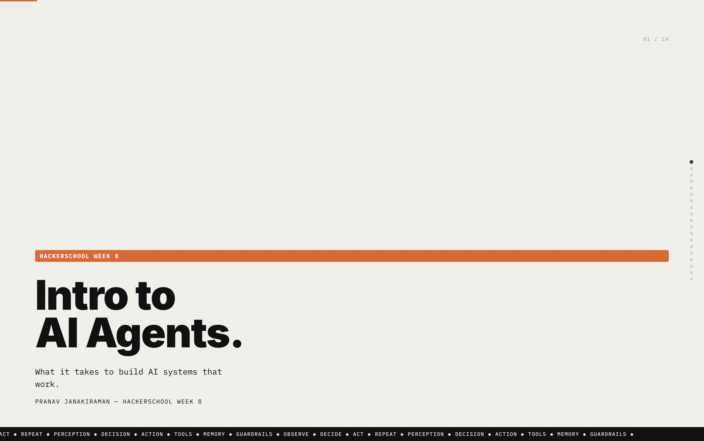

# NUS Intro to AI Agents — Hacker School Week 8

This is the chatbot starter repo for the **Intro to AI Agents** workshop. You'll be building an AI-powered investigation assistant that can call tools, fetch data from APIs, and solve challenges autonomously.

## What is this?

This is a Next.js chatbot built with the [Vercel AI SDK](https://sdk.vercel.ai). It comes pre-configured with:

- A chat interface powered by OpenRouter (Claude, GPT, etc.)
- Guest authentication (no sign-up needed)
- A tool system where you define functions the AI can call
- A multi-round challenge system connected to the [NEXUS Arena](https://arena-murex.vercel.app)

## What you'll be doing

During the workshop, you'll learn how to give an AI agent capabilities by creating **tools** — functions the AI can decide to call on its own. Each tool connects to an API endpoint on the Arena, letting the AI search access logs, look up employees, read communications, and more.

The challenges are structured across 5 rounds, each requiring new tools and increasingly complex reasoning from the AI.

## Getting started

1. Clone this repo
2. Copy `.env.example` to `.env.local` and fill in your keys (see the [Docs](https://arena-murex.vercel.app/docs) for details)
3. Install dependencies: `npm install`
4. Run the dev server: `npm run dev`
5. Open [http://localhost:3000](http://localhost:3000)

## Key files

| File | What it does |
|------|-------------|
| `lib/ai/tools/` | Where you create your tool files |
| `app/(chat)/api/chat/route.ts` | Where you register tools with the AI |
| `lib/types.ts` | Where you register tool types for the UI |
| `components/message.tsx` | Where tool call results render in the chat |
| `lib/ai/prompts.ts` | The system prompt that guides the AI |

## Resources

- [Arena & Docs](https://arena-murex.vercel.app/docs) — tool reference, env setup, wiring instructions
- [Vercel AI SDK](https://sdk.vercel.ai/docs) — framework documentation
